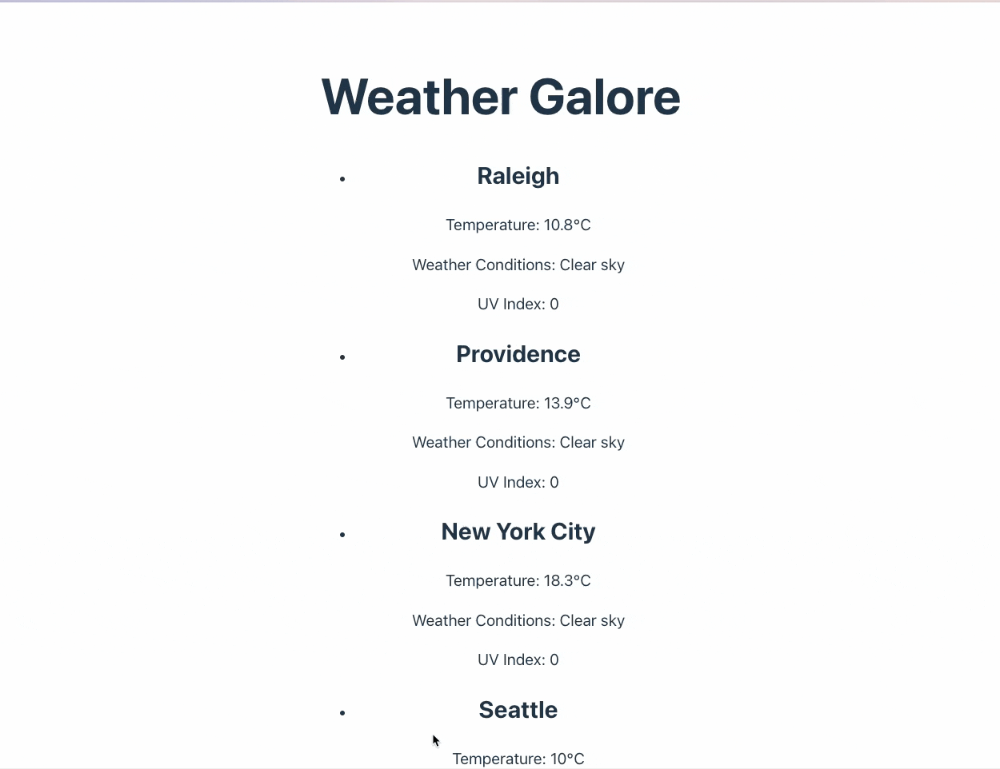

# Web Development Project 5 - Books Galore

Submitted by: Jacob Solano

This web app: Shows book data from the OpenLibrary API.

Time spent: **2** hours spent in total

## Required Features

The following **required** functionality is completed:

- [x] **The list displays a list of data fetched using an API call**
- [x] **Data uses the useEffect React hook and async/await syntax**
- [x] **The app dashboard includes at least three summary statistics about the data such as**

  - [x] _Tempature_
    - [x] _Weather Conditions_
      - [x] _UV Index_

- [ ] **A search bar allows the user to search for an item in the fetched data**
- [ ] **Multiple different filters (2+) allow the user to filter items in the database by specified categories**

The following **optional** features are implemented:

- [ ] Multiple filters can be applied simultaneously
- [ ] Filters use different input types such as a text input, a selection, or a slider
- [ ] The user can enter specific bounds for filter values

The following **additional** features are implemented:

- [ ] List anything else that you added to improve the site's functionality!

## Video Walkthrough

Here's a walkthrough of implemented user stories:

<!-- Replace this with whatever GIF tool you used! -->

GIF created with GIFSKI.

<!-- Recommended tools:
[Kap](https://getkap.co/) for macOS
[ScreenToGif](https://www.screentogif.com/) for Windows
[peek](https://github.com/phw/peek) for Linux. -->

## Notes

Describe any challenges encountered while building the app.
- time...